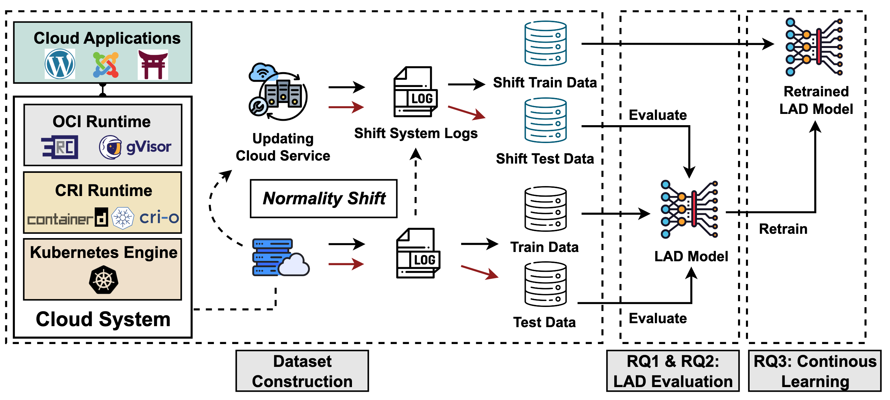

<p align="center">

  <h1 align="center">CAShift: Benchmarking Log-Based Cloud Attack Detection under Normality Shift</h1>
  <div>This repository contains (1) vulnerability dataset (2) system log collection framework (3) our proposed AE/VAE baselines for benchmarking used in the research paper "CAShift: Benchmarking Log-Based Cloud Attack Detection under Normality Shift". The paper is accepted at The ACM International Conference on the Foundations of Software Engineering (FSE 2025)</div>
    <br>
  <div>Authors: Jiongchi Yu, Xiaofei Xie, Qiang Hu, Bowen Zhang, Ziming Zhao, Yun Lin, Lei Ma, Ruitao Feng, Frank Liauw</div>

  <p align="center">
  <br>
    <a href="https://sites.google.com/view/cashift-bench"><strong>Project Website</strong></a>
    |
    <a href="https://conf.researchr.org/details/fse-2025/fse-2025-research-papers/9/CAShift-Benchmarking-Log-Based-Cloud-Attack-Detection-under-Normality-Shift"><strong>Conference</strong></a>
    |
    <a href="https://arxiv.org/abs/2504.09115"><strong>Paper (Arxiv)</strong></a>
  </p>
</p>

---

<!-- The code is designed to facilitate the analysis of open-source projects. The instructions provided below are provided to help reproduce the results of RQ1-RQ3 from the paper. Note that the code can be easily adapted for analyzing other open-source projects with minimal modifications to the configuration file. -->

***This repository is not in its final version; certain documentation sections are still being updated.***

## Overview

<div>

</div>

## Content

The code of this project is organized into two main parts:
1. [The CAShift Dataset Collection Framework](./Dataset/)
2. [The CAShift Benchmarking Baselines](./Benchmark/)

To directly use the CAShift dataset, please directly visit our [shared online drive](https://smu-my.sharepoint.com/:f:/g/personal/jcyu_2022_phdcs_smu_edu_sg/El02T_OyFTRHoVEd4mEExD8B3MkrV4wgXkv4IEDLHjqh6g?e=4DZAdT)

The environment setup instructions and detailed usage guidance can be found in the README files located within each corresponding subdirectory.

## Community Contributions

We welcome all contributions to improve our dataset, including but not limited to adding new cloud applications, introducing new attack scenarios, and contributing additional baselines etc. Feel free to submit a pull request :)

## Citation

Cite as below if you find this repository helpful to your project:

```
@article{yu2025cashift,
    title      = {CAShift: Benchmarking Log-Based Cloud Attack Detection under Normality Shift},
    author     = {Yu, Jiongchi Yu and Xie, Xiaofei and Hu, Qiang and Zhang, Bowen and Zhao, Ziming and Lin, Yun and Ma, Lei and Feng, Ruitao and Liauw, Frank},
    journal    = {Proceedings of the ACM on Software Engineering},
    year       = {2025}
    volume     = {X},
    number     = {FSE},
    pages      = {XXX-XXX},
    publisher  = {ACM New York, NY, USA}
}
```

## Acknowledgement

Many thanks to [Jiahao Ying](https://yingjiahao14.github.io/) for providing extra computing servers for the benchmarking experiments.

This research is partially supported by the Lee Kong Chian Fellowship, the National Research Foundation, Singapore, and the Cyber Security Agency under its National Cybersecurity R&D Programme (NCRP25-P04-TAICeN). Any opinions, findings and conclusions or recommendations expressed in this material are those of the author(s) and do not reflect the views of National Research Foundation, Singapore and Cyber Security Agency of Singapore.
